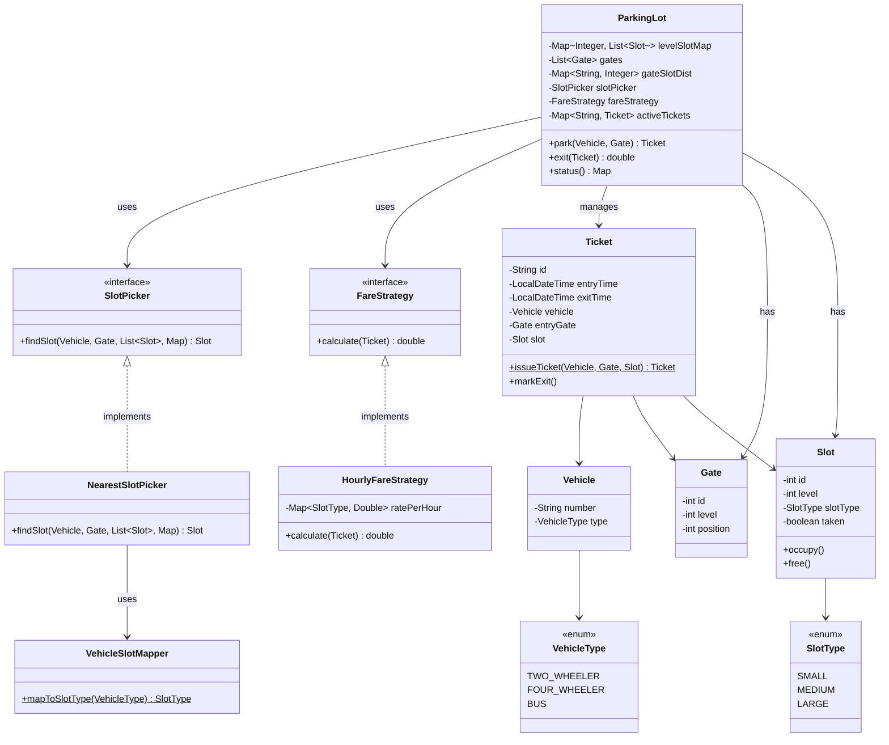

# Parking Lot Design (LLD)

A multilevel parking lot system built to practice low-level design and SOLID principles.

## What it does

- Multi-level parking lot with configurable slots and gates
- Assigns the **nearest available slot** to whichever gate a vehicle enters from
- Generates tickets on entry, calculates fare on exit
- Slot picking and fare calculation are **swappable strategies** (injected at runtime)

## Class Diagram



## How to run

```bash
cd src
javac com/example/parking/*.java
java com.example.parking.App
```
